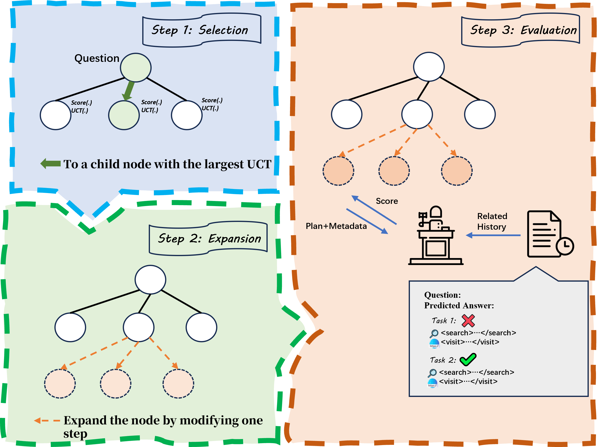
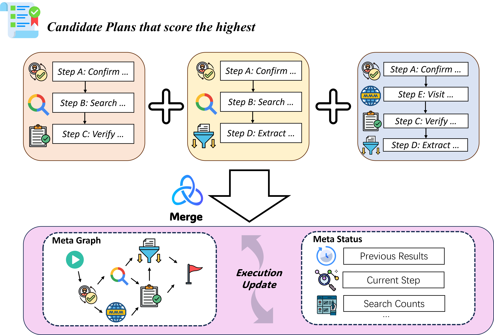
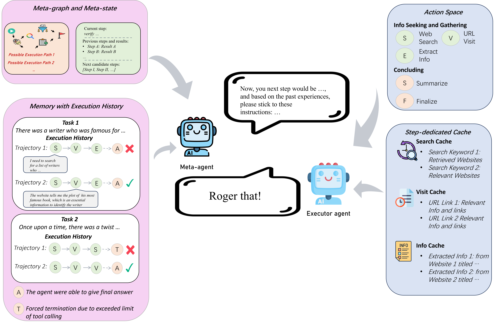

# Meta-thinker (enhancing deep research agents with meta-planning and transferable memory)

## Features

🤖 A meta-agent that provides detailed steps and instructions for a specified task using transferable memory through tree-search planning and plan merging.




🔎 A web exploring agent that is able to conduct web search and visit websites.



## Reproduction

🔌Currently supported providers:
- OpenAI
- Qwen series (WIP)

For reproducing results on GAIA benchmark:

1. Clone the repository and enter the directory:

```shell
git clone https://github.com/XiangKeYiNTU/meta-researcher.git
cd meta-researcher
```

2. Download the GAIA benchmark from [GAIA](https://huggingface.co/datasets/gaia-benchmark/GAIA/tree/main), make a `dataset` folder under the repo folder, and move the downloaded dataset into it.

When finished, check if the benchmark is downloaded and moved correctly:

```shell
ls dataset/
> GAIA

ls dataset/GAIA/
> 2023  GAIA.py  README.md
```

3. Create conda environment and install required packages

```shell
conda create -n meta-researcher
conda activate meta-researcher
pip install -r requirements.txt
```

4. Copy `.env.example`, rename it as `.env`, and add your API keys

```shell
cp .env.example .env
```

The API keys needed:

```shell
OPENAI_API_KEY=
SERP_API_KEY=
JINA_API_KEY=
OPENROUTER_API_KEY=
HF_TOKEN=
```

5. Execute the shell script

```shell
chmod +x chmod +x run_gaia_openai.sh
./run_gaia_openai.sh
```

The default tested split is "validation" and the level is 1. You can change them in `run_gaia_openai.py`

The execution results will be saved into `GAIA_level1_validation_results.json`.

6. Evaluate the results

First download the repo from [exact_match](https://huggingface.co/spaces/evaluate-metric/exact_match/tree/main) and run `evaluate_gaia.py` to get the results on EM (Exact Metric), specify the level, split, and the result JSON path

```shell
python evaluate_gaia.py --level 1 --split "validation" --result_path "./GAIA_level1_validation_results.json"
```

**BONUS**: you can also run inference on a single question using the following command:

```shell
python run_single_question_openai.py "Your question here" [--file_path "The path of the given file"] (Optional)
```
